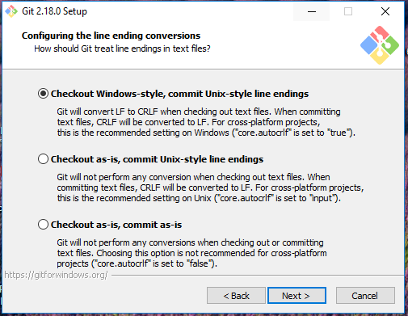

# Git Install Screenshots

## Free Software

Git is free, open-source software. As part of the workshop we are trying to arrange a BigFix push such that a Git installation could be pushed to everyones' computer by EISD (EZtech) remotely. If you are using a personal computer for the workshop, or if your office is not supported by EISD, or if you just want to be on the safe side, we wanted to provide some helpful instructions.

Make sure to do your free software request form in advance! You can use the following example language for the form:

**Justification:** Git is a version control system (VCS) used to track changes and collaborate on code development in conjunction with services such as Github and Bitbucket. Git and Github allows developers to follow open source projects, share code, and track code changes through the development process. Git is necessary for using the EPA Github account or Bitbucket server. The windows version of Git ("Git for Windows") is available for download here: https://gitforwindows.org/
**Software Title:** Git

## Install Location

Make sure you know where Git is installed! Some places it may have ended up:

* `C:\Program Files\Git` (EZtech/EISD installation will be here)
* `C:\Users\<useraccountname>\AppData\Local\Programs\Git`
    
Note that the `AppData` directory is hidden. 

If you do not have administrator rights, it is possible to install Git in a user directory for easy updating later. I recommend:

    C:\Users\USERNAME\Programs\Git\

Another way to try to find a Git installation or to test that Git is accessible is to type `where git` from Git-Bash or a command prompt.

## Options

During the installation process, the installer asks several questions about how you would like to set up Git for Windows. I have found the default options to work well! (and you can change them later anyway)

If you want the details, screenshots and commentary are below.

1.	Install default components including Git Bash and Git GUI

Git Bash is a unix-like command prompt for using Git. Git-GUI is a basic graphical interface, again for using Git. We will use both in the workshop.

2.	Nano editor

Git occasionally needs a command line text editor, this determines what it will open. I have found nano easier than vim, but neither is particularly natural.

3.	Use Git from the windows command prompt

4.	Default OpenSSL library

5.	Checkout Windows-style, commit Unix-style.

This option ensures that people on Windows, Mac, and Linux machines can all collaborate on the same files. Since most EPA users are on windows, this probably usually isn't a big deal in any case.

6.	Use MinTTY (the default terminal)

7.	Credential manager. When you access your Github account, Git will ask for your username and password. The windows credential manager will cache your password so that you don't need to re-enter it every time. In addition, you can access your cached credentials later by going to Control Panel > Credential Manager > Windows Credentials > Generic Credentials

## Test your Installation

Once you have gone through the installation process, you should test to make sure it worked. Go to a command prompt or Git Bash and type `git --version`
Hopefully you see something like: 

