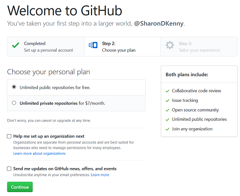
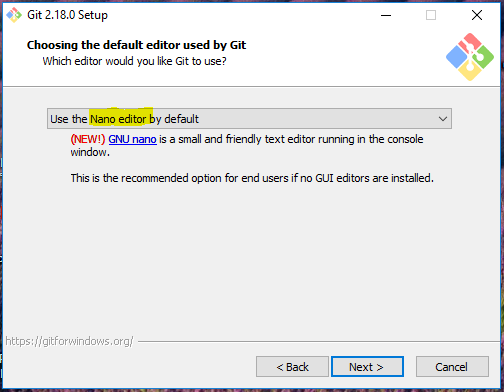
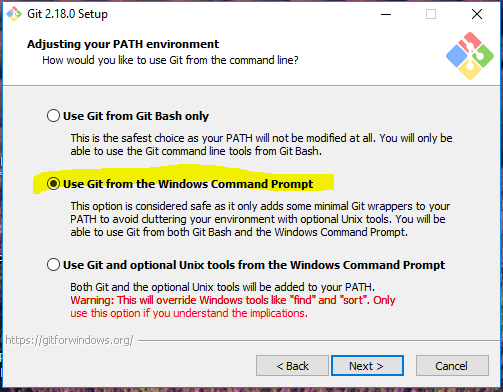
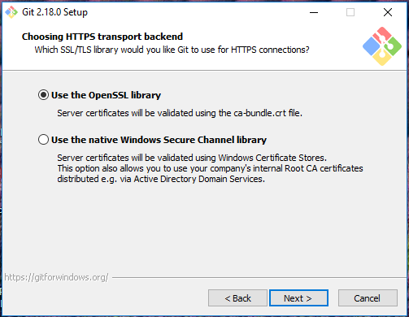
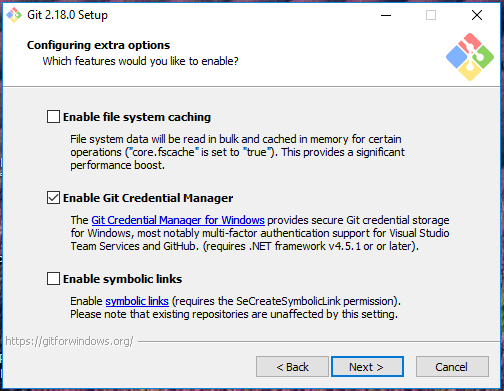
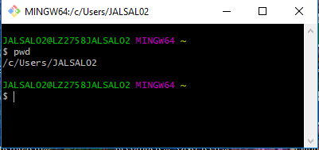
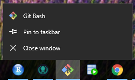
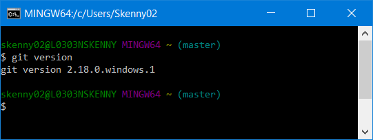
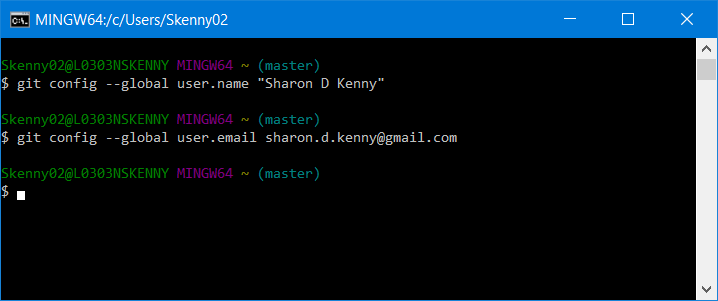
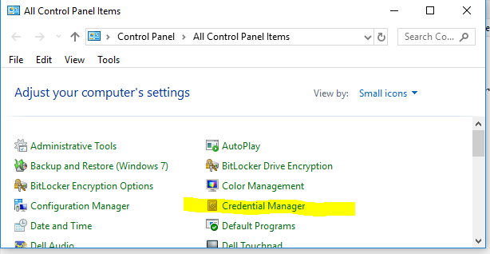

# Pre-Workshop Setup

Prior to the workshop, please try to get your machine set up with the following things:

- [ ] Get a Github account
- [ ] Install or update Git
- [ ] Verify Git installation and introduce yourself to Git
- [ ] Prove Git can talk to Github
- [ ] Cache your username and password
- [ ] If you use RStudio (or other Git-aware IDE), check it can find Git

These steps are from the pre-workshop instructions from Jenny Bryan's [happy-git-with-R](http://happygitwithr.com/workshops). Her guide has useful advice for many of these steps.

If you get stuck, you can contact Jameel (alsalam.jameel@epa.gov). He is happy to help troubleshoot. Another alternative is to try to arrive at the workshop session early.

## Get a Github Account

Github is a cloud service for sharing and collaborating on code. Basically: Sharepoint for code. It is based on Git for version control, but just as Sharepoint is not Office, Github (the cloud service) is distinct from Git (the version control software). You can read EPA's current guidance for Github on the [EPA intranet](https://www.epa.gov/webguide/github-guidance).

You can register a Github account yourself at https://www.github.com. 

  
Expand detailed Github Steps Here

  

While most things about your account can be changed later, Jenny Bryan suggests thinking a little bit about [picking your username](http://happygitwithr.com/github-acct.html#github-acct). 

A Github account can be associated with multiple email addresses. The EPA Github Guidance states that EPA employees should [create a new account associated with their EPA email address](https://www.epa.gov/webguide/github-guidance#who) when contributing to a repository associated with the EPA organization. However, Github recommends that users have only [one account for both personal and professional repositories](https://help.github.com/articles/merging-multiple-user-accounts/).

The page that opens next can be skipped. Click "submit"

You are now inside Github. Click the button **"Start a Project"**

A page will open, where you will be asked to confirm your email.

Log in to the email account you used to register and confirm your account registration. This concludes teh Github registration process.

## Install or Update Git

Git is the version control software which underlies Github, and it needs to be installed for you to contribute to code repositories on Github or Bitbucket.

For Windows laptops, you can get the Git for Windows installer at either of the following pages:
* https://gitforwindows.org/
* https://git-scm.com/download/win

You get the same files from either page. The first page is specifically about the windows project, while the second is about the overall Git project.

  
Expand detailed Git installation steps here

### Free Software

Git is free, open-source software. As part of the workshop we are trying to arrange a BigFix push such that a Git installation could be pushed to everyones' computer by EISD (EZtech) remotely. If you are using a personal computer for the workshop, or if your office is not supported by EISD, or if you just want to be on the safe side, we wanted to provide some helpful instructions.

Make sure to do your free software request form in advance! You can use the following example language for the form:

**Justification:** Git is a version control system (VCS) used to track changes and collaborate on code development in conjunction with services such as Github and Bitbucket. Git and Github allows developers to follow open source projects, share code, and track code changes through the development process. Git is necessary for using the EPA Github account or Bitbucket server. The windows version of Git ("Git for Windows") is available for download here: https://gitforwindows.org/
**Software Title:** Git

### Install Location

Make sure you know where Git is installed! Some places it may have ended up:

* `C:\Program Files\Git` (EZtech/EISD installation will be here)
* `C:\Users\<useraccountname>\AppData\Local\Programs\Git`
    
Note that the `AppData` directory is hidden. 

If you do not have administrator rights, it is possible to install Git in a user directory for easy updating later. I recommend:

    C:\Users\USERNAME\Programs\Git\

Another way to try to find a Git installation or to test that Git is accessible is to type `where git` from Git-Bash or a command prompt.

### Options

During the installation process, the installer asks several questions about how you would like to set up Git for Windows. I have found the default options to work well! (and you can change them later anyway)

If you want the details, screenshots and commentary are below.

1.	Install default components including Git Bash and Git GUI

Git Bash is a unix-like command prompt for using Git. Git-GUI is a basic graphical interface, again for using Git. We will use both in the workshop.

2.	Nano editor

Git occasionally needs a command line text editor, this determines what it will open. I have found nano easier than vim, but neither is particularly natural.

3.	Use Git from the windows command prompt

4.	Default OpenSSL library

5.	Checkout Windows-style, commit Unix-style.

This option ensures that people on Windows, Mac, and Linux machines can all collaborate on the same files. Since most EPA users are on windows, this probably usually isn't a big deal in any case.

6.	Use MinTTY (the default terminal)

7.	Credential manager. When you access your Github account, Git will ask for your username and password. The windows credential manager will cache your password so that you don't need to re-enter it every time. In addition, you can access your cached credentials later by going to Control Panel > Credential Manager > Windows Credentials > Generic Credentials

## Configure Git 

To test and configure the Git installation, we will need to use Git Bash (or a command prompt) and put in a few commands.

From: [Introduce Yourself to Git](http://happygitwithr.com/hello-git.html)

  
Expand configuration steps here

To open Git Bash, you can search for it in the start menu:

This will open up the Bash terminal. The prompt looks a little different than you might be used to. You can use `pwd` to find out what directory you are in.

I like to pin Git-Bash to the task bar for easy access by right-clicking:

To see whether Git is working, type the following:

    git --version
    
Hopefully you see something like:

Configure Git by adding your user name and email

    git config --global user.name "Sharon D Kenny"
    git config --global user.email sharon.d.kenny@gmail.com
    

This sort of approach can be used for other configuration to. If you use Notepad++, maybe you want to tell Git to use that for your text editor:

Confirm the configuration entries you provided:

    git config --global --list

### Git Graphical Clients

Git is a command-line program, but there are also various graphical tools which provide a point-and-click GUI interface layered on top of Git. Under the hood these are still using the same set of tools as you would find at the command line.

Jenny Bryan recommends [installing a Git client](http://happygitwithr.com/git-client.html). 

For this workshop, we will be using Git-GUI, which is a very basic graphical client that is included with Git for Windows. If you are an R user, RStudio can also serve as a Git client for some operations. Two popular modern Git clients are GitKraken and Sourcetree. The workshop organizers investigated the possibility of using one of these for the workshop, but due to the short time and consideration requirements for EPA software, were not able to standardize prior to the session.

## Prove Git can Talk to Github

Follow approach [here](http://happygitwithr.com/push-pull-github.html)

## Cache Username and Password for Github

As you go about your business, windows can cache your Github credentials so that you can perform Git operations without constantly re-entering your username and password. This usually just works!

  
Expand discussion of credential caching here

Follow approach [here](http://happygitwithr.com/credential-caching.html)

If you selected the defaults when installing Git, then you are using the [Git credential manager for windows](https://github.com/Microsoft/Git-Credential-Manager-for-Windows/wiki/How-the-Git-Credential-Managers-works) to cache your passwords. This is a Git feature provided by Microsoft and works by storing saved passwords in the regular Windows store based on url. 

Because the Windows credential store works on url, you can't cache credentials for two different accounts for the same url (e.g., if you have both work and personal Github accounts). If you need to delete stored credentials, you can go to:

    Control Panel >> Credential Manager >> Windows Credentials >> Generic Credentials

Once you have some cached credentials, they will show up as something like:

    git:https://github.com

## Connect RStudio (or other IDE) to Git

[Approach here](http://happygitwithr.com/rstudio-git-github.html)

QUESTION: are there other commonly used EPA IDE's or code editors that have Git integration to add here?

