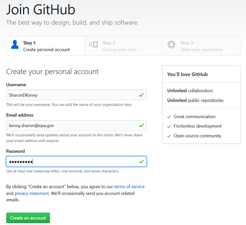
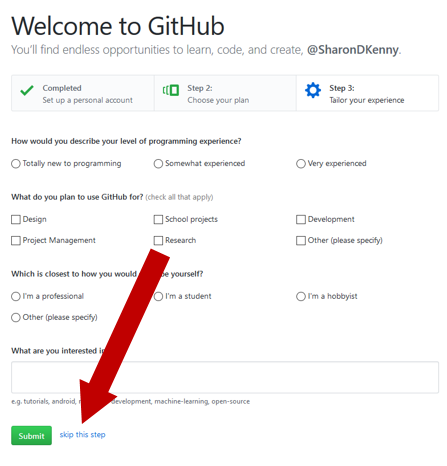
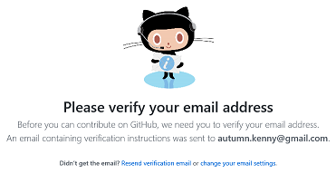
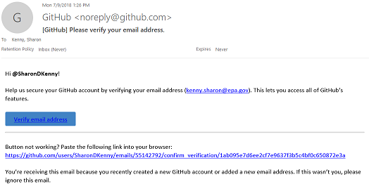

# Pre-Workshop Setup

Prior to the workshop, please try to get your machine set up with the following things:

- [ ] Get a Github account
- [ ] Install or update Git
- [ ] Verify Git installation and introduce yourself to Git
- [ ] Prove Git can talk to Github
- [ ] Cache your username and password
- [ ] If you use RStudio (or other Git-aware IDE), check it can find Git

These steps are from the pre-workshop instructions from Jenny Bryan's [happy-git-with-R](http://happygitwithr.com/workshops). Her guide has useful advice for many of these steps.

If you get stuck, you can contact Jameel (alsalam.jameel@epa.gov). He is happy to help troubleshoot. Another alternative is to try to arrive at the workshop session early.

## Get a Github Account

Github is a cloud service for sharing and collaborating on code. Basically: Sharepoint for code. It is based on Git for version control, but just as Sharepoint is not Office, Github (the cloud service) is distinct from Git (the version control software). You can read EPA's current guidance for Github on the [EPA intranet](https://www.epa.gov/webguide/github-guidance).

You can register a Github account yourself at https://www.github.com. 

While most things about your account can be changed later, Jenny Bryan suggests thinking a little bit about [picking your username](http://happygitwithr.com/github-acct.html#github-acct). 

A Github account can be associated with multiple email addresses. The EPA Github Guidance states that EPA employees should [create a new account associated with their EPA email address](https://www.epa.gov/webguide/github-guidance#who) when contributing to a repository associated with the EPA organization. However, Github recommends that users have only [one account for both personal and professional repositories](https://help.github.com/articles/merging-multiple-user-accounts/).

The page that opens next can be skipped. Click "submit"

You are now inside Github. Click the button **"Start a Project"**

A page will open, where you will be asked to confirm your email.

Log in to the email account you used to register and confirm your account registration. This concludes teh Github registration process.

## Install or Update Git

Git is the version control software which underlies Github, and it needs to be installed for you to contribute to code repositories on Github or Bitbucket.

For Windows laptops, you can get the Git for Windows installer at either of the following pages:
* https://gitforwindows.org/
* https://git-scm.com/download/win

You get the same files from either page. The first page is specifically about the windows project, while the second is about the overall Git project.

Here you can find [detailed Git installation steps and screenshots](00-git-install.md)

## Test Git Installation 

Open Git Bash or a command prompt and type the following:

    git --version
    
Hopefully you see something like:

## Configure Git

From: [Introduce Yourself to Git](http://happygitwithr.com/hello-git.html)

Configure Git by adding your user name and email

    git config --global user.name "Sharon D Kenny"
    git config --global user.email sharon.d.kenny@gmail.com
    

If you use Notepad++ you can change your text editor:

Confirm the configuration entries you provided:

    git config --global --list

### Git Graphical Clients

Git is a command-line program, but there are also various graphical tools which provide a point-and-click GUI interface layered on top of Git. Under the hood these are still using the same set of tools as you would find at the command line.

Jenny Bryan recommend [installing a Git client](http://happygitwithr.com/git-client.html). For this workshop, we will be using Git-GUI, which is a very basic graphical client that is included with Git for Windows. If you are an R user, RStudio can also serve as a Git client for some operations. Two popular modern Git clients are GitKraken and Sourcetree. The workshop organizers investigated the possibility of using one of these for the workshop, but due to the short time and consideration requirements for EPA software, were not able to standardize prior to the session.

## Prove Git can Talk to Github

Follow approach [here](http://happygitwithr.com/push-pull-github.html)

## Cache Username and Password for Github

Follow approach [here](http://happygitwithr.com/credential-caching.html)

If you selected the defaults when installting Git, then you are using the [Git credential manager for windows](https://github.com/Microsoft/Git-Credential-Manager-for-Windows/wiki/How-the-Git-Credential-Managers-works) to cache your passwords. This is a Git feature provided by Microsoft and works by storing saved passwords in the regular Windows store based on url.

Because the Windows credential store works on url, you can't cache credentials for two different accounts for the same url (e.g., if you have both work and personal Github accounts). If you need to delete stored credentials, you can go to:

    Control Panel >> Credential Manager >> Windows Credentials >> Generic Credentials
    
Once you have some cached credentials, they will show up as something like:

    git:https://github.com
    

## Connect RStudio (or other IDE) to Git

[Approach here](http://happygitwithr.com/rstudio-git-github.html)

QUESTION: are there other commonly used EPA IDE's or code editors that have Git integration to add here?

